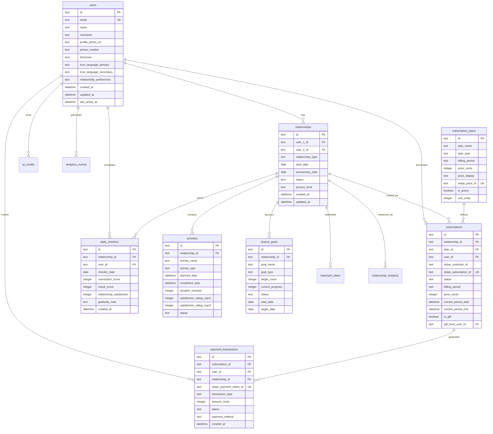
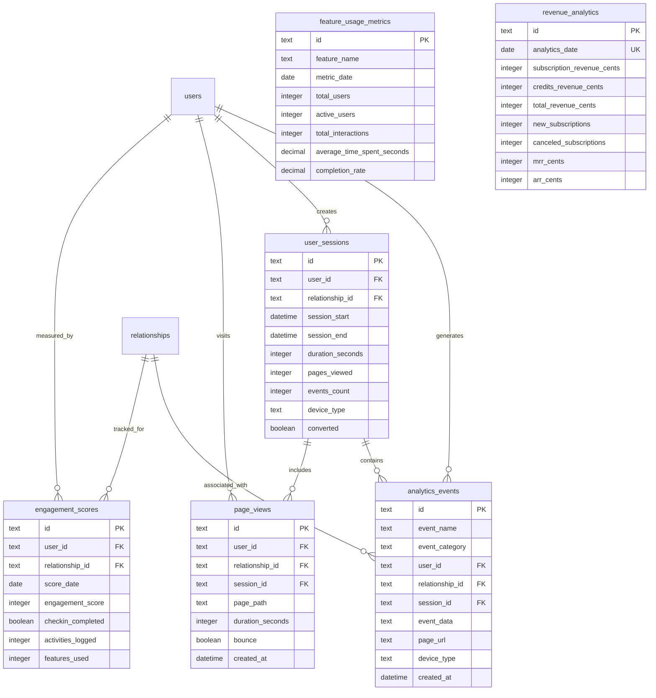
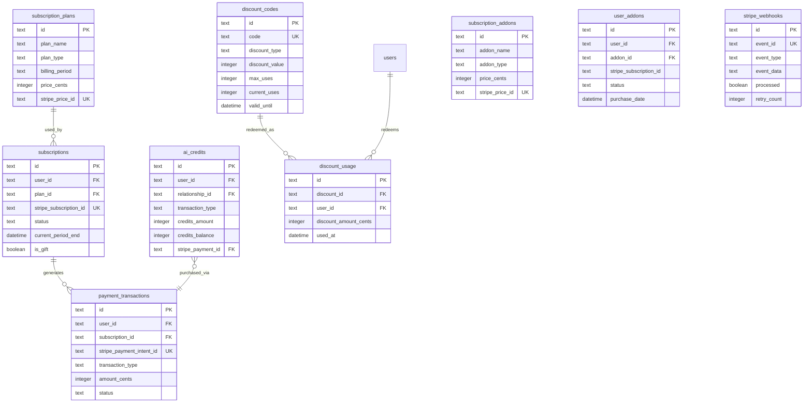
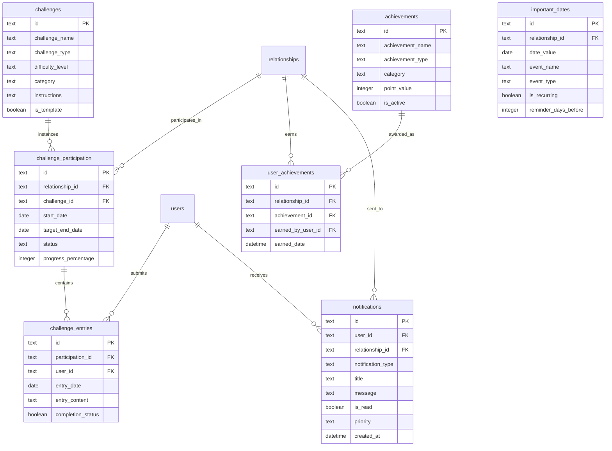
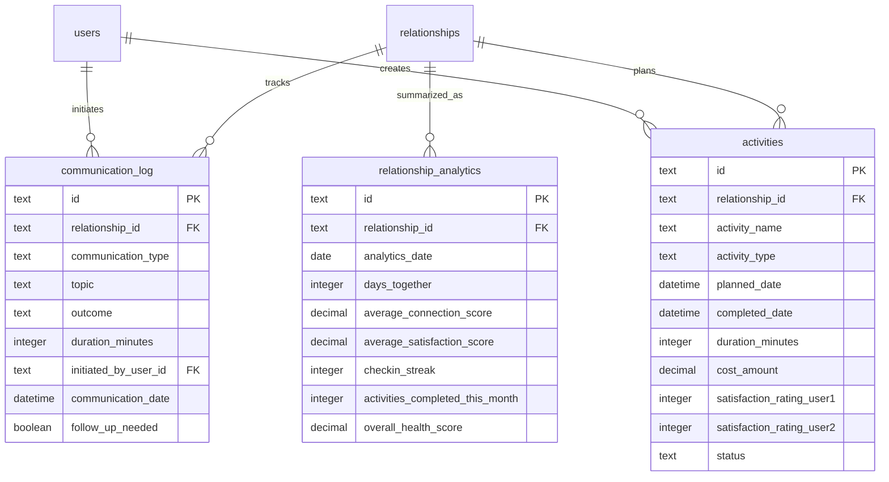

# Better Together - Entity Relationship Diagram

## Core Relationships Schema



---

## Analytics & Events Schema



---

## Payment System Schema



---

## Gamification & Content Schema



---

## Communication & Activity Schema



---

## Index Strategy Overview

### High-Performance Indexes

**User Lookups**:
- `idx_users_email` (unique) - Fast authentication
- Primary key on `id`

**Relationship Queries**:
- `idx_relationships_users` - Find relationships by user
- `idx_relationships_status` - Active relationship filtering

**Subscription Operations**:
- `idx_subscriptions_user` - User's subscription lookup
- `idx_subscriptions_status` - Active subscription queries
- `idx_subscriptions_stripe_customer` - Stripe integration
- `idx_subscriptions_period_end` - Expiration checking

**Payment Transactions**:
- `idx_payment_transactions_user` - User payment history
- `idx_payment_transactions_subscription` - Subscription payments
- `idx_payment_transactions_status` - Successful payments
- `idx_payment_transactions_created` - Time-based queries

**Analytics Events**:
- `idx_analytics_events_user` - User activity tracking
- `idx_analytics_events_category` - Event type filtering
- `idx_analytics_events_session` - Session reconstruction
- `idx_analytics_events_created` - Time-range queries

**Engagement Tracking**:
- `idx_engagement_scores_user` - User engagement history
- `idx_engagement_scores_date` - Daily engagement queries

---

## Key Relationships Summary

### Core Platform
- **Users ↔ Relationships**: Many-to-many (user can have multiple relationships)
- **Relationships ↔ Activities**: One-to-many (shared experiences)
- **Relationships ↔ Goals**: One-to-many (shared objectives)
- **Relationships ↔ Check-ins**: One-to-many (wellness tracking)

### Payment System
- **Users ↔ Subscriptions**: One-to-many (can gift multiple)
- **Plans ↔ Subscriptions**: One-to-many (plan instances)
- **Subscriptions ↔ Transactions**: One-to-many (billing history)
- **Users ↔ Credits**: One-to-many (credit transactions)

### Analytics
- **Users ↔ Events**: One-to-many (user actions)
- **Sessions ↔ Events**: One-to-many (session activity)
- **Users ↔ Engagement**: One-to-many (daily scores)

### Gamification
- **Challenges ↔ Participation**: One-to-many (challenge instances)
- **Participation ↔ Entries**: One-to-many (daily entries)
- **Achievements ↔ User Achievements**: One-to-many (earned badges)

---

## Data Flow Patterns

### User Sign-up Flow
```
1. Create user record → users
2. Send invitation → notifications
3. Create relationship → relationships
4. Track event → analytics_events
5. Create user session → user_sessions
```

### Subscription Purchase Flow
```
1. Select plan → subscription_plans
2. Create Stripe checkout → (external)
3. Receive webhook → stripe_webhooks
4. Create subscription → subscriptions
5. Create transaction → payment_transactions
6. Track conversion → analytics_events
7. Update revenue → revenue_analytics
```

### Daily Check-in Flow
```
1. Submit check-in → daily_checkins
2. Update relationship analytics → relationship_analytics
3. Calculate engagement score → engagement_scores
4. Track event → analytics_events
5. Send partner notification → notifications
```

### Analytics Aggregation Flow
```
1. Collect events → analytics_events
2. Aggregate daily → feature_usage_metrics
3. Calculate engagement → engagement_scores
4. Compute revenue → revenue_analytics
5. Update cohorts → user_cohorts
```

---

**Legend**:
- PK = Primary Key
- FK = Foreign Key
- UK = Unique Key
- `||--o{` = One-to-many relationship
- `}o--||` = Many-to-one relationship

---

**Generated**: 2025-12-17
**Schema Version**: 3 (migrations 0001-0003)
**Total Tables**: 40+
**Total Relationships**: 60+
